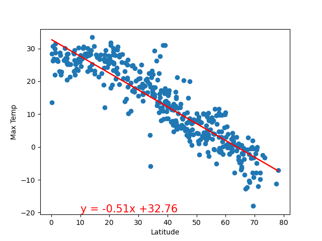
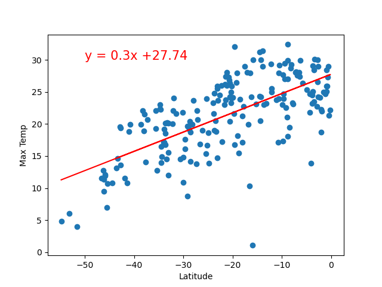
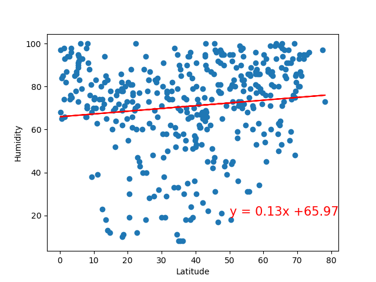
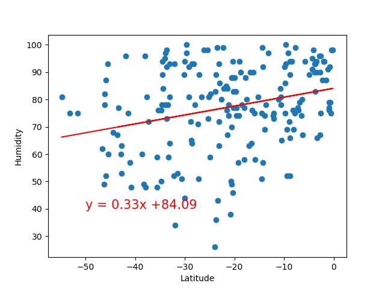
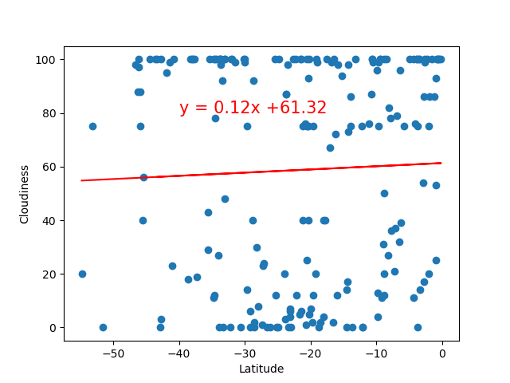
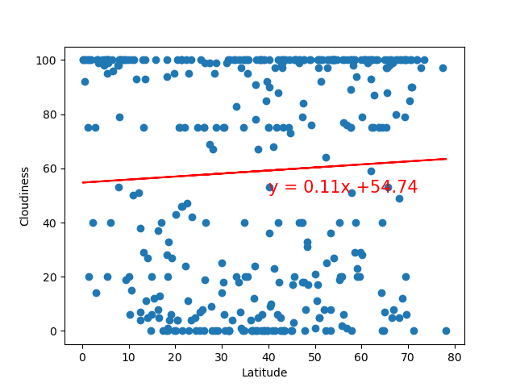
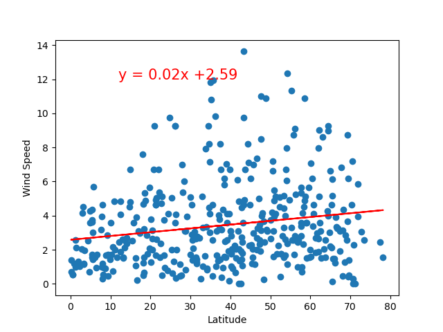
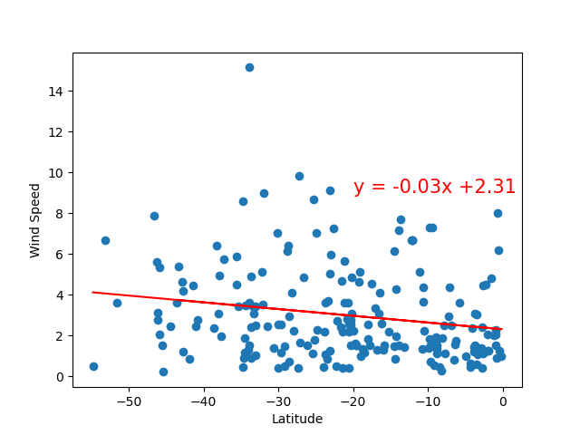

# python-api-challenge

### Description

Data's true power is its ability to definitively answer questions. So, let's take what you've learned about Python requests, APIs, and JSON traversals to answer a fundamental question: "What is the weather like as we approach the equator?"

Now, we know what you may be thinking: “That’s obvious. It gets hotter.” But, if pressed for more information, how would you prove that?

### Info / Credits

- Analysis by
   * `João Pedro Fortunato` [@joaopedrofortunato](https://github.com/joaopedrofortunato)

- `REPO:` https://github.com/joaopedrofortunato/python-api-challenge.git

### Outputs and Conclusions

#### Latitude vs Max Temperature
##### For the Northern Hemisphere, an R-value of 0.81 suggests a strong relationship between latitude and maximum temperature, while for the Southern Hemisphere an R-value of 0.45 suggests a moderate relationship. However, it's important to remember that correlation alone does not imply causation.

#### Latitude vs Humidity
##### For both hemispheres, R-values of 0.01 and 0.08 suggest a weak relationship between latitude and humidity. However, it's important to remember that correlation alone does not imply causation. 

#### Latitude vs Cloudiness
##### For both hemispheres, R-values of 0.003 and 0.002 suggest that the relationship between latitude and cloudiness is technically non-existent. However, it's important to remember that correlation alone does not imply causation.

#### Latitude vs Wind Speed
##### For both hemispheres, R-values of 0.03 suggest a very weak relationship between latitude and wind speed. However, it's important to remember that correlation alone does not imply causation.

